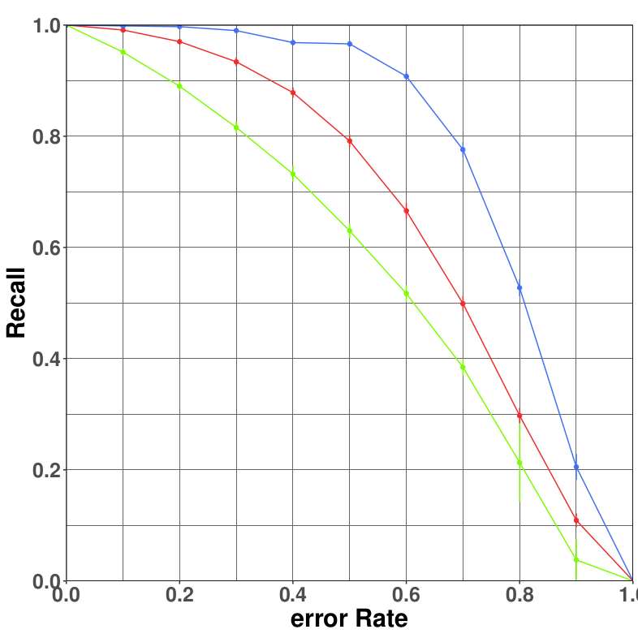

# NetworkReco

Still working on this. Network reconstruction from data, based on Newman's 2018 
"Stimating network structure from unreliable measurements" algorithm. 

The code to generate simulated network data, and fit using Newman's EM algorithm.

References:

[1] M. E. J. Newman, Network structure from rich but noisy data, nature physics, 2018.

[2] example EM algo structure: http://www.di.fc.ul.pt/~jpn/r/EM/EM.html

  
  <!--  -->

